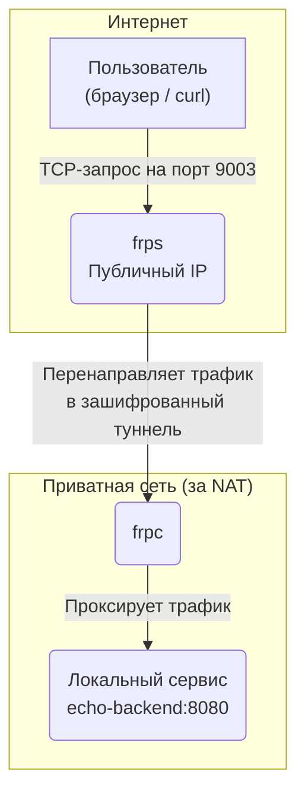
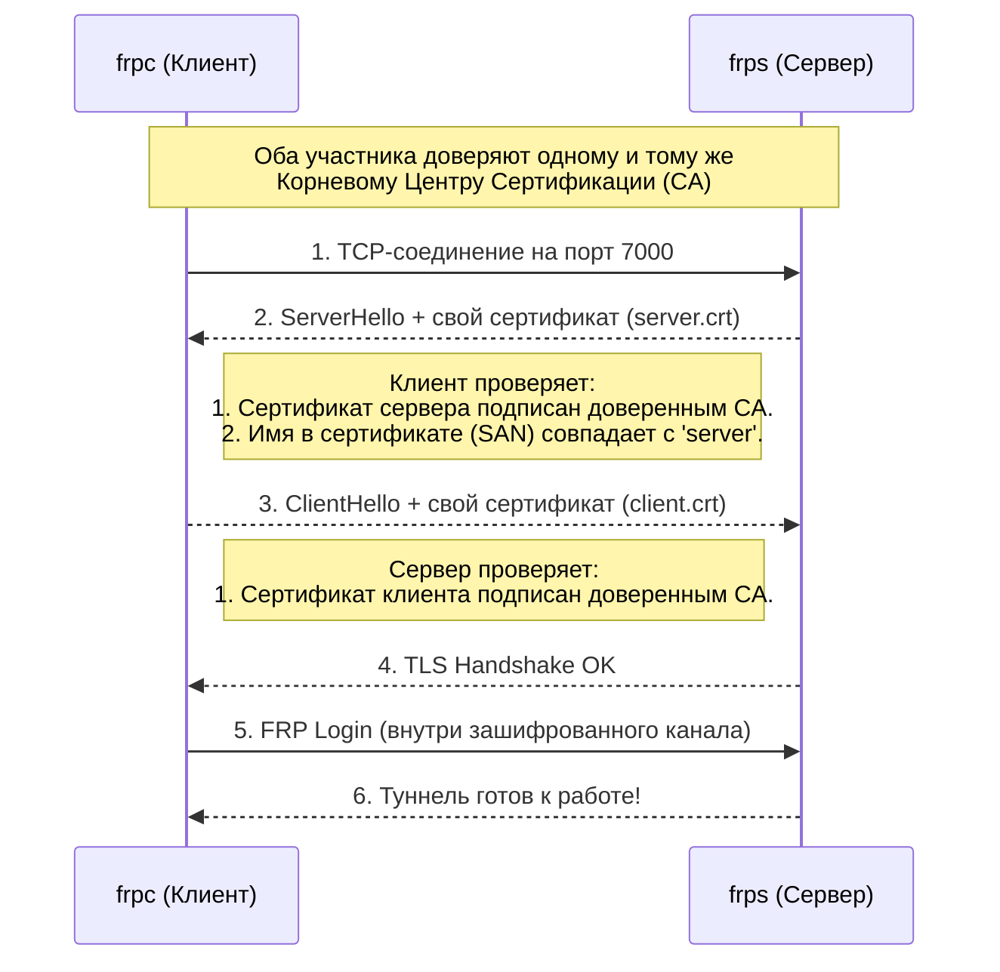

# FRP mTLS LAB 🛡️

В этой лабе мы создадим защищенный туннель между двумя машинами с помощью **FRP (Fast Reverse Proxy)**. Главная особенность нашего подхода — аутентификация будет происходить исключительно через **взаимный TLS (mTLS)**, без использования паролей или токенов.

**Основная цель** — научиться безопасно "выставлять" в интернет сервисы, которые находятся за NAT или файрволом (например, домашний веб-сервер, IoT-устройство или внутренний сервис компании), не открывая при этом входящие порты на стороне клиента.

По итогам этой работы вы:
*   Поймете принципы работы mTLS и инфраструктуры открытых ключей (PKI).
*   Получите готовый к использованию шаблон на Docker Compose для быстрого развертывания.
*   Научитесь генерировать и подписывать сертификаты для своих нужд.
*   Будете готовы к развертыванию подобной схемы на реальных серверах.

## Оглавление
1. [Схема сети и взаимодействия](#1)
2. [Теоретическая минутка](#2)
    - [Как работает обратный прокси-туннель (FRP)?](#3)
    - [Сертификаты, CA и магия mTLS](#4)
3. [Практика](#5)
    - [Подготовка окружения](#6)
    - [Клонирование репозитория и структура проекта](#7)
    - [Генерация сертификатов](#8)
    - [Запуск сервера (frps)](#9)
    - [Запуск клиента (frpc)](#10)
    - [Проверка соединения и траблшутинг](#11)
    - [Остановка и очистка стенда](#12)
4. [Дальнейшие шаги](#13)
    - [Советы по продвинутому использованию](#14)
    - [Гайд по развертыванию на реальных серверах](#15)
    - [Дополнительные материалы](#16)

<a id="1"></a>

## Схема сети и взаимодействия

Мы построим стенд, имитирующий реальную ситуацию: есть публичный сервер (`frps`) и клиент (`frpc`), находящийся в приватной сети.

**Логика потока данных:**



**Процесс установки соединения (TLS Handshake):**



<a id="2"></a>

## Теоретическая минутка

<a id="3"></a>

### Как работает обратный прокси-туннель (FRP)?

Классический прокси принимает соединения и перенаправляет их "вперед" к целевым серверам. **Обратный прокси** работает наоборот. Клиент (`frpc`), находящийся в закрытой сети, сам инициирует *исходящее* соединение с публичным сервером (`frps`). Это соединение поддерживается активным. Когда внешний пользователь обращается к `frps` на определенный порт, `frps` пересылает этот трафик "назад" клиенту `frpc` через уже установленный туннель.

Это позволяет обойти ограничения NAT и файрволов, которые обычно блокируют входящие соединения.

<a id="4"></a>

### Сертификаты, CA и магия mTLS

*   **TLS (Transport Layer Security):** Стандартный протокол защиты данных в сети. В 99% случаев в интернете используется односторонний TLS: ваш браузер (клиент) проверяет сертификат веб-сайта (сервера), чтобы убедиться, что это действительно `google.com`, а не фишинговый сайт.

*   **mTLS (Mutual TLS):** Взаимный TLS. Это как двусторонний паспортный контроль. Не только клиент проверяет сервер, но и **сервер проверяет клиента**. Каждый участник должен предъявить сертификат, которому доверяет другая сторона.

*   **Сертификат (`.crt`):** Цифровой "паспорт". Содержит публичный ключ и информацию о владельце (например, доменное имя `server` или `client`).

*   **Приватный ключ (`.key`):** Секретный ключ, парный к публичному. Только владелец приватного ключа может доказать, что он является легитимным владельцем сертификата. **Его утечка компрометирует всю систему безопасности.**

*   **Центр Сертификации (CA - Certificate Authority):** Доверенный "паспортный стол". CA использует свой собственный приватный ключ (`CA.key`) для цифровой подписи сертификатов клиентов и серверов. Когда `frps` получает сертификат от `frpc`, он видит подпись и проверяет: "Ага, этот сертификат подписан тем самым CA, которому я доверяю. Значит, клиент 'свой'".

*   **Почему `CA.key` нужно хранить в строжайшем секрете?**
    Если злоумышленник украдет приватный ключ вашего CA, он сможет выпустить **любой валидный сертификат** (например, `evil_client.crt`). Ваша система будет доверять этому сертификату, так как он подписан легитимным (хоть и украденным) ключом. Это позволит атакующему подключиться к вашему серверу и получить доступ к вашим внутренним ресурсам. **Ключ CA — это ключ от всего.**

<a id="5"></a>

## Практика

<a id="6"></a>

### Подготовка окружения

Убедитесь, что у вас установлены следующие инструменты:

| Инструмент    | Версия                    | Назначение                                |
|---------------|---------------------------|-------------------------------------------|
| Docker Engine | ≥ 23.0                    | Для запуска контейнеров (compose v2 встроен) |
| OpenSSL       | ≥ 1.1                     | Для ручной генерации сертификатов         |
| Git           | Любая                     | Для клонирования репозитория с лабой      |

<a id="7"></a>

### Клонирование репозитория и структура проекта

```bash
git clone https://github.com/silkslime/frp-lab.git
cd frp-lab
```

Структура проекта после всех шагов будет выглядеть так:
```
.
├── frpgen                # Скрипт для генерации сертификатов
├── frps/
│   ├── docker-compose.yml
│   └── frps.toml
├── frpc/
│   ├── docker-compose.yml
│   └── frpc.toml
└── certs/                # Папка для сертификатов (будет создана)
    ├── FRP_CA.crt
    ├── FRP_CA.key
    ├── client/
    │   ├── client.crt
    │   └── client.key
    └── server/
        ├── server.crt
        └── server.key
```

<a id="8"></a>

### Генерация сертификатов

#### Способ 1 (Рекомендуемый): С помощью скрипта `frpgen`

Этот скрипт-обертка над OpenSSL автоматизирует создание CA и подпись сертификатов.

```bash
# 1. Создаем Корневой Сертификат (CA) в папке certs/
./frpgen root certs --overwrite

# 2. Создаем и подписываем сертификат для сервера (CN=server)
./frpgen client certs/server --ca certs

# 3. Создаем и подписываем сертификат для клиента (CN=client)
./frpgen client certs/client --ca certs
```
*Проверка (опционально):* `frpgen check certs/server --ca certs` должен вернуть `OK`.

#### Способ 2 (Для глубокого понимания): Вручную с помощью OpenSSL
Этот способ полностью повторяет действия, которые выполняет скрипт `frpgen` "под капотом". Он полезен, если вы хотите досконально понять процесс или если у вас нет возможности использовать скрипт.
<details>
<summary>Нажмите, чтобы развернуть инструкции для ручной генерации</summary>

##### Подготовка: Создаем структуру директорий

```bash
mkdir -p certs/server certs/client
```

##### **Шаг 1: Создание Корневого Центра Сертификации (CA)**

CA — это основа доверия в нашей системе. Мы создадим его приватный ключ и самоподписанный публичный сертификат.

1.  **Генерируем приватный ключ CA (4096 бит):**
    ```bash
    openssl genrsa -out certs/FRP_CA.key 4096
    ```

2.  **Создаем самоподписанный сертификат CA (срок действия 10 лет):**
    ```bash
    openssl req -new -x509 \
      -key certs/FRP_CA.key \
      -sha256 -days 3650 \
      -subj "/CN=FRP" \
      -addext "basicConstraints=critical,CA:TRUE,pathlen:0" \
      -addext "keyUsage=critical,keyCertSign,cRLSign" \
      -out certs/FRP_CA.crt
    ```

> **Что здесь происходит? Разбор ключевых параметров:**
>
> *   `-subj "/CN=..."`: Устанавливает `Common Name` (общее имя) для нашего CA.
> *   `-addext "basicConstraints=critical,CA:TRUE,pathlen:0"`: **Это самый важный флаг.** Он добавляет в сертификат расширение, которое прямо указывает:
>     *   `CA:TRUE`: Этот сертификат является сертификатом Центра Сертификации.
>     *   `critical`: Это расширение является критически важным, и любая система, проверяющая сертификат, *обязана* его понимать и учитывать.
>     *   `pathlen:0`: Ограничение, которое запрещает этому CA создавать другие, промежуточные CA. Он может подписывать только конечные сертификаты (как наши `server` и `client`). Это хорошая практика безопасности.
> *   `-addext "keyUsage=critical,keyCertSign,cRLSign"`: Указывает, для чего может использоваться этот ключ. `keyCertSign` — это разрешение на подпись других сертификатов.

##### **Шаг 2: Создание сертификата для сервера (frps)**

Теперь, имея свой "паспортный стол" (CA), мы можем выдать "паспорт" (сертификат) нашему серверу.

1.  **Генерируем приватный ключ для сервера (2048 бит):**
    ```bash
    openssl genrsa -out certs/server/server.key 2048
    ```

2.  **Создаем Запрос на Подпись Сертификата (CSR - Certificate Signing Request):**
    CSR — это "заявка" на получение сертификата, которая содержит публичный ключ и информацию о владельце.
    ```bash
    openssl req -new -key certs/server/server.key \
      -subj "/CN=server" \
      -addext "subjectAltName=DNS:server" \
      -out certs/server/server.csr
    ```
    > **Важно:** Мы используем `-addext "subjectAltName=DNS:server"`. **SAN (Subject Alternative Name)** — это современный стандарт для указания имен хостов в сертификатах. `Common Name` (CN) считается устаревшим для этих целей.

3.  **Подписываем CSR с помощью нашего CA:**
    На этом шаге CA проверяет запрос и, если все в порядке, выпускает полноценный сертификат.
    ```bash
    openssl x509 -req -in certs/server/server.csr \
        -CA certs/FRP_CA.crt \
        -CAkey certs/FRP_CA.key \
        -CAcreateserial \
        -days 825 -sha256 \
        -copy_extensions copy \
        -out certs/server/server.crt
    ```
> **Разбор ключевых параметров:**
>
> *   `-CAcreateserial`: Создает файл `FRP_CA.srl`. OpenSSL требует вести "журнал" выданных сертификатов, сохраняя их серийные номера в этом файле. Он будет создан автоматически при первом запуске.
> *   `-copy_extensions copy`: **Критически важный флаг!** Он приказывает OpenSSL скопировать расширения (в нашем случае — `subjectAltName`) из CSR в конечный сертификат. **Без этого флага SAN будет утерян**, и клиент не сможет проверить имя сервера, что приведет к ошибке TLS.

##### **Шаг 3: Создание сертификата для клиента (frpc)**

Процесс абсолютно идентичен созданию сертификата для сервера, меняются только имена файлов и `CN`/`SAN`.

1.  **Генерируем ключ клиента:**
    ```bash
    openssl genrsa -out certs/client/client.key 2048
    ```

2.  **Создаем CSR для клиента:**
    ```bash
    openssl req -new -key certs/client/client.key \
      -subj "/CN=client" \
      -addext "subjectAltName=DNS:client" \
      -out certs/client/client.csr
    ```

3.  **Подписываем CSR клиента с помощью CA:**
    ```bash
    openssl x509 -req -in certs/client/client.csr \
      -CA certs/FRP_CA.crt \
      -CAkey certs/FRP_CA.key \
      -CAcreateserial \
      -days 825 -sha256 \
      -copy_extensions copy \
      -out certs/client/client.crt
    ```
    *Обратите внимание, что мы повторно используем флаг `-CAcreateserial`. OpenSSL просто обновит существующий файл `FRP_CA.srl` новым серийным номером.*

##### **Шаг 4: Очистка (Опционально)**

Файлы запросов на подпись (`.csr`) были промежуточными и больше не нужны. Их можно безопасно удалить.

```bash
rm certs/server/server.csr certs/client/client.csr
```

После выполнения этих шагов у вас будет точно такая же структура файлов в папке `certs`, как и при использовании скрипта `frpgen`, но теперь вы знаете, как и почему работает каждая команда.


</details>

<a id="9"></a>

### Запуск сервера (frps)

Переходим в директорию сервера и запускаем его.

```bash
cd frps
docker compose up -d
```

Проверяем логи, чтобы убедиться, что сервер успешно стартовал:
```bash
docker compose logs -f
# Ожидаемый вывод:
# frps-1  | [I] [frps/root.go:114] frps started successfully
```

**Разбор конфигурации `frps.toml`:**
```toml
# frps.toml
bindPort = 7000                      # Порт для подключения клиентов (frpc).

# --- Секция TLS ---
transport.tls.force = true           # ОБЯЗАТЕЛЬНО. Запрещает небезопасные подключения.
# Путь к сертификату и ключу сервера внутри контейнера.
transport.tls.certFile = "/etc/frp/certs/frps.crt"
transport.tls.keyFile = "/etc/frp/certs/frps.key"
# Путь к публичному сертификату нашего CA. Им сервер будет проверять клиентов.
transport.tls.trustedCaFile = "/etc/frp/certs/FRP_CA.crt"

# --- Политики ---
# Список портов, которые клиенты могут запрашивать для прокси.
allowPorts = [
  { single = 9003 },
  { start = 9050, end = 9100 }
]

# --- Веб-интерфейс (Dashboard) ---
webServer.addr = "0.0.0.0"
webServer.port = 7500
webServer.user = "admin"
webServer.pass = "admin"
```

<a id="10"></a>

### Запуск клиента (frpc)

Теперь запускаем клиентский стек, который включает `frpc` и тестовый `echo-backend`.

```bash
cd ../frpc
docker compose up -d
```

**Разбор конфигурации `frpc.toml`:**
```toml
# frpc.toml
serverAddr = "frps"                  # DNS-имя сервера. Docker Compose автоматически разрешит его в IP контейнера frps.
serverPort = 7000

# --- Секция TLS ---
transport.tls.enable = true
# Имя хоста для проверки в сертификате сервера. ДОЛЖНО СОВПАДАТЬ с SAN/CN в server.crt.
transport.tls.serverName = "server"
# Пути к сертификатам клиента внутри контейнера.
transport.tls.certFile = "/etc/frp/certs/frpc.crt"
transport.tls.keyFile = "/etc/frp/certs/frpc.key"
# Путь к CA, которым клиент будет проверять сертификат сервера.
transport.tls.trustedCaFile = "/etc/frp/certs/FRP_CA.crt"

# --- Описание прокси ---
[[proxies]]
name = "echo-service-via-mtls"       # Уникальное имя прокси
type = "tcp"                         # Тип прокси (может быть http, https, udp и т.д.)
localIP = "backend"                  # DNS-имя сервиса, который мы хотим опубликовать
localPort = 8080                     # Порт этого сервиса
remotePort = 9003                    # Порт, который будет открыт на сервере FRPS
```

<a id="11"></a>

### Проверка соединения и траблшутинг

1.  **Проверяем доступ к нашему сервису через сервер `frps`:**
    ```bash
    curl http://127.0.0.1:9003
    ```
    Вы должны увидеть JSON-ответ от `echo-backend`, содержащий информацию о вашем HTTP-запросе.

2.  **Открываем Dashboard сервера:**
    Перейдите в браузере по адресу `http://127.0.0.1:7500`.
    *   **Логин:** `admin`
    *   **Пароль:** `admin`
    В разделе **Proxies -> TCP** вы увидите ваш `echo-service-via-mtls` со статусом `online`.

**Что если не работает? (Траблшутинг)**

*   **Соединение не устанавливается:** Проверьте логи сервера `docker compose -f frps/docker-compose.yml logs -f`.
    *   `remote error: tls: bad certificate`: Самая частая ошибка. Означает, что сервер не смог проверить сертификат клиента. Причины:
        1.  Клиент не предоставил сертификат.
        2.  Сертификат клиента подписан не тем CA (`trustedCaFile`).
        3.  Сертификат клиента просрочен.
*   **Клиент не может подключиться к серверу:** Проверьте логи клиента `docker compose -f frpc/docker-compose.yml logs -f`.
    *   `tls: failed to verify certificate: x509: certificate is not valid for any names, but wanted to match server`: Ошибка в `transport.tls.serverName` в `frpc.toml`. Оно не совпадает с `DNS:server` в сертификате сервера.
*   **`curl` выдает `connection refused`:**
    1.  Убедитесь, что оба стека (`frps` и `frpc`) запущены (`docker ps`).
    2.  Проверьте, что в логах `frps` и `frpc` установилось соединение.
    3.  Проверьте, что порт `9003` в `frpc.toml` (`remotePort`) разрешен в `allowPorts` на сервере.

<a id="12"></a>

### Остановка и очистка стенда

Чтобы остановить все контейнеры и удалить созданные ими тома (volumes) и сети, выполните:

```bash
# Останавливаем и удаляем клиентский стек
docker compose -f frpc/docker-compose.yml down -v

# Останавливаем и удаляем серверный стек
docker compose -f frps/docker-compose.yml down -v

# Удаляем общую сеть (если она осталась)
docker network rm frp-lab_frpnet
```

<a id="13"></a>

## Дальнейшие шаги

Поздравляем! Вы успешно развернули безопасный туннель с аутентификацией по mTLS. Теперь у вас есть надежный шаблон, который можно адаптировать для реальных задач.

<a id="14"></a>

### Советы по продвинутому использованию

#### Хранение частей .toml конфига в ENV

Никогда не храните пароли и токены в файлах конфигурации в Git. FRP поддерживает шаблонизацию конфигов.

**Пример:**
В `frps.toml` меняем `webServer.pass`:
```toml
webServer.pass = "{{ .Envs.FRP_DASHBOARD_PASS }}"
```
В `frps/docker-compose.yml` добавляем переменную окружения:
```yaml
services:
  frps:
    # ...
    environment:
      - FRP_DASHBOARD_PASS=mySuperSecretPassword123
```
Теперь пароль можно передавать через секреты Docker/Kubernetes или CI/CD.

#### Двухфакторная аутентификация: mTLS + Token

mTLS — это фактор "то, что у тебя есть" (приватный ключ). Для дополнительной защиты можно добавить фактор "то, что ты знаешь" (токен).

Добавьте в `frps.toml` и `frpc.toml`:
```toml
# frps.toml
auth.method = "token"
auth.token = "YOUR_SHARED_SECRET_TOKEN"

# frpc.toml
auth.method = "token"
auth.token = "YOUR_SHARED_SECRET_TOKEN"
```
Теперь для подключения клиенту потребуется и валидный сертификат, и правильный токен.

<a id="15"></a>

### Гайд по развертыванию на реальных серверах

1.  **Сервер (`frps`):**
    *   Арендуйте VPS с публичным "белым" IP-адресом.
    *   (Опционально) Зарегистрируйте доменное имя, например `frp.yourdomain.com`, и направьте его на IP вашего VPS.
    *   При генерации сертификата для сервера укажите это доменное имя в SAN: `DNS:frp.yourdomain.com`.
    *   В файрволе сервера откройте порты: `bindPort` (например, 7000/tcp) и `remotePort`'ы, которые вы будете использовать (например, 9003/tcp).
2.  **Клиент (`frpc`):**
    *   В `frpc.toml` измените `serverAddr` на доменное имя или IP вашего сервера.
    *   Измените `transport.tls.serverName` на ваше доменное имя, чтобы оно совпадало с SAN сертификата сервера.
3.  **Развертывание:**
    *   Вы можете использовать тот же Docker Compose, но для продакшена рекомендуется запускать `frps` и `frpc` как системные службы (systemd). Готовые unit-файлы можно найти в официальном репозитории FRP.

<a id="16"></a>

### Дополнительные материалы

*   **Официальная документация FRP:** [https://gofrp.org/](https://gofrp.org/)
*   **Репозиторий FRP на GitHub:** [https://github.com/fatedier/frp](https://github.com/fatedier/frp)
*   **Подробнее про SAN vs CN:** [Stack Overflow: Is Common Name deprecated?](https://stackoverflow.com/questions/59353608/is-cn-common-name-deprecated-in-favor-of-subject-alternative-name)
*   **Протоколы KCP и QUIC:** FRP поддерживает мультиплексирование и передачу данных поверх UDP (KCP, QUIC) для сетей с большой потерей пакетов. Это может значительно улучшить производительность туннеля.

---
**Happy Tunnelling! 🚀**